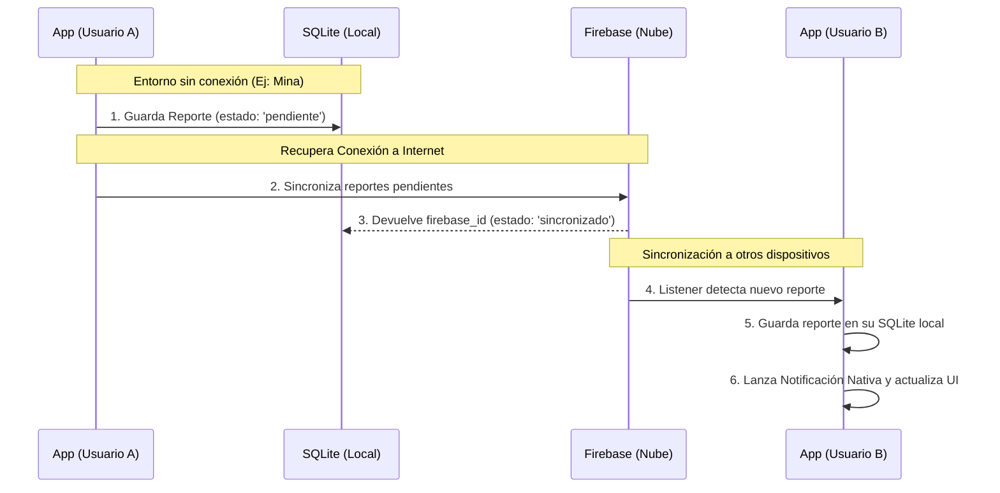
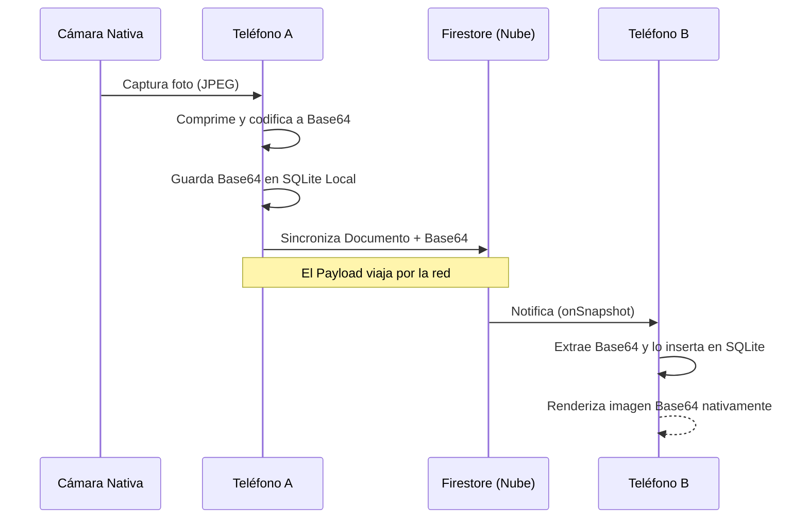
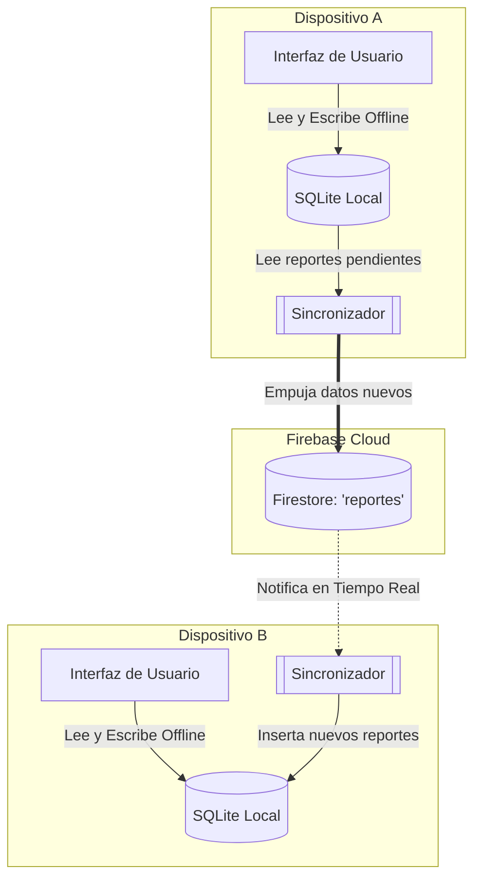

# Report Seeker

Una aplicación móvil diseñada para registrar, gestionar y sincronizar reportes fotográficos en terreno, pensada para condiciones de conectividad limitadas o nulas. Construida con tecnologías web (React + Vite) y empaquetada como aplicación nativa usando Capacitor.

## Funcionalidades Principales

- **Gestión de Reportes en Terreno**: Creación de reportes fotográficos detallados (incluyendo imagen, severidad, descripción, ubicación GPS automática y estado).
- **Modo Offline Robusto (First-Offline)**: Uso intensivo de SQLite nativo (`CapacitorSQLite`). Los reportes creados sin conexión se guardan en la "Bandeja de Salida" (Cola) y no se pierden.
- **Sincronización Inteligente**: Sistema de sincronización con Firebase (Firestore) que detecta cuando la conexión a Internet vuelve, permitiendo subidas seguras y controladas. Incluye un botón de sincronización manual para los reportes en cola.
- **Autenticación y Seguridad**: Sistema de login completo usando Firebase Auth, complementado con una capa de seguridad local mediante un PIN numérico interactivo (PinPad) que bloquea la app tras inactividad o cierre.
- **Notificaciones Nativas**: Integración de notificaciones locales y push para alertar al usuario sobre eventos importantes (reportes subidos, sincronización, etc.).
- **Modo Oscuro/Claro Automático**: Interfaz completamente adaptada para el confort visual, siguiendo las preferencias del sistema operativo o manual, con colores de fondo y texto dependientes del estado.
- **Seekie AI (En desarrollo)**: Interfaz de asistente de inteligencia artificial integrada directamente en la aplicación para asistencia inteligente al usuario y búsqueda rápida de reportes.

##  Tecnologías Utilizadas

- **Frontend**: React 19, TypeScript, Vite, Material UI (MUI).
- **Móvil / Nativo**: Capacitor 8 (Plugins de Cámara, SQLite, Filesystem, Network, Notificaciones, File Opener, App).
- **Backend / Nube**: Firebase (Authentication, Firestore).
- **Estilos**: Vanilla CSS con variables nativas para el control de temas, modo nocturno y animaciones fluidas (MD3).

## Arquitectura de Sincronización (Local-First)

Para garantizar que la aplicación funcione perfectamente en entornos de faena o zonas con nula conectividad, **Report Seeker** utiliza una arquitectura de sincronización **Local-First**. 

El flujo de trabajo asegura que ningún dato se pierda y que la experiencia sea fluida:
1. **Creación Desconectada**: Los reportes se guardan instantáneamente en una base de datos **SQLite nativa** dentro del dispositivo, marcados como pendientes en la "Bandeja de Salida" (Cola).
2. **Subida Diferida**: Cuando se recupera la red (o mediante el botón de sincronización), los reportes en cola se empujan de forma segura a **Firebase Firestore**.
3. **Distribución Transparente**: Firebase notifica a los demás dispositivos mediante *listeners* (`onSnapshot`). Los otros dispositivos descargan el nuevo reporte a su propio SQLite local y lanzan una **Notificación Nativa** alertando al usuario.

### Gestión y Transferencia de Imágenes

Debido a los requerimientos de trabajo desconectado, las fotografías capturadas no pueden depender de URLs web clásicas para ser mostradas. La transferencia de imágenes de un dispositivo a otro se maneja mediante codificación **Base64** directamente embebida en el payload de datos:

1. **Captura y Compresión**: La cámara nativa captura la imagen y Capacitor la comprime.
2. **Almacenamiento Local**: La imagen se codifica en Base64 y se incrusta dentro del registro en SQLite. Esto garantiza que siempre que el reporte esté en el teléfono, la foto se pueda ver (sin requerir caché de red).
3. **Transporte en la Nube**: Al sincronizar, la cadena de texto Base64 viaja dentro del documento de Firestore. Al llegar al dispositivo de otro usuario, se inyecta directamente en su base local, permitiendo visualizar la foto inmediatamente incluso si el dispositivo receptor pierde la señal segundos después.

### Esquema Híbrido de Bases de Datos

La aplicación utiliza un motor de almacenamiento de "dos vías" donde **SQLite** actúa como la única fuente de la verdad para la Interfaz de Usuario (UI) —haciendo la app ultra rápida—, mientras que **Firestore** actúa como el canal de mensajería y respaldo global.

- **SQLite (Local)**: Contiene los campos con un `id` local, y una columna `firebase_id` para vincular los datos con la nube y evitar duplicados. La columna `estado_sync` (pendiente / sincronizado) indica al motor de sincronización qué datos son nuevos.
- **Firestore (Nube)**: Almacena la misma estructura para compartirse con los demás usuarios, utilizando el UUID nativo de Firebase como identificador principal de cada documento.

## Requisitos del Sistema

Para compilar y ejecutar la aplicación en dispositivos móviles Android:
- **SDK Mínimo**: **API 24** (Android 7.0 Nougat o superior).
- **SDK Objetivo**: **API 36**.
- **Node.js**: v18+ recomendado para el entorno de desarrollo local.
- **NPM**: v9+.

## Recuperación de PIN

La recuperación envía un enlace de acceso por correo con Firebase Authentication. Tras abrirlo, la aplicación compara el correo verificado con el correo guardado en Firestore para el ID de trabajador indicado y permite establecer un PIN nuevo de cuatro dígitos.

Para habilitar el envío:
- En Firebase Console, activa el proveedor **Correo electrónico/Contraseña** y la opción **Enlace por correo electrónico (sin contraseña)** en Authentication.
- Agrega `report-seeker-d8526.web.app` a los dominios autorizados de Authentication.
- En web se usa el origen actual como URL de continuación. En Android se usa `https://<projectId>.web.app` por defecto; `VITE_RECOVERY_CONTINUE_URL` puede sobrescribirla si se despliega en otro dominio.

### Apertura del enlace directamente en Android

El proyecto Android registra el dominio de Firebase Authentication como Android App Link y pasa el enlace recibido a la pantalla de recuperación.

##  Historial de Cambios (Changelog)

### v0.8.0 (Actual) - Material Design 3
- Estandarización del diseño a uno cómodo y predecible.
- Implementación del idioma ingles.
### v0.7.2 - Preparación para IA
- Adaptación del diseño de pestaña y menú para el asistente inteligente.
- Creación de la estructura visual de "Seekie AI" al estilo moderno y conversacional.

### v0.7.0 - Cola Offline y Sincronización
- Creado botón de sincronización manual ("Sincronizar Cola").
- Implementada la vista de Bandeja de Salida (Cola) para reportes pendientes.
- BottomNav ampliado para soportar hasta 5 accesos directos de navegación.
- Bug sobre el home arreglado (reportes "fantasma" que desaparecían).

### v0.6.0 - Autenticación y Seguridad Local
- Problema grave de sesión solucionado (Persistencia local en el dispositivo).
- Sistema de cambio de PIN y correo electrónico implementado.
- Rediseño completo y estético de la pantalla de Login con manejo de errores visual.
- Implementación del sistema de Login con Firebase Authentication.

### v0.5.0 - Integración Backend (Firebase)
- Arreglos en el sistema de notificaciones nativas push/local.
- Implementación de Firestore funcional para lectura y escritura.
- Sistema de barra de progreso interactivo en las tarjetas de reportes.
- Conexión oficial a Firebase establecida en el entorno de la app.
- Sistema de subida de información mejorada desde la base local SQLite a la Nube.

### v0.4.0 - Interfaz de Detalles y Refactorización
- Refactorización masiva para optimización de rendimiento y separación de componentes.
- Menú de configuración agregado dentro de la navegación.
- Rediseño del panel de información (Vista de Detalles de Reporte).
- Cambios menores al diseño y organización de la lista de notificaciones.

### v0.3.0 - Perfil y Ubicación
- Se agregó el guardado de ubicación en el *notification card*.
- Mejoras en la visualización e interacciones de las notificaciones por fecha.
- Menú de perfil rediseñado para soportar funciones extendidas.
- Creación de archivos relacionados a la gestión avanzada del perfil del usuario.

### v0.2.0 - Base de Datos y Primeros Reportes
- Conectividad de la interfaz gráfica con el modelo y entidad de "Reporte".
- Inicialización e integración del plugin robusto de Capacitor SQLite.
- Creación de la estructura base de la base de datos local y su esquema.
- Archivos y componentes básicos para el flujo de captura fotográfica del reporte.

### v0.1.0 - Estructura Inicial
- Creación de la estructura base del sistema (Vite + React + TS).
- Implementación del modo oscuro/claro con transiciones suaves por CSS puro.
- Construcción y mejoras iterativas de la navegación inferior (BottomNav).
- Detalles, tipografías y esquemas de los primeros componentes visuales.

---
*Report Seeker - Desarrollado y mantenido de manera confidencial.*
